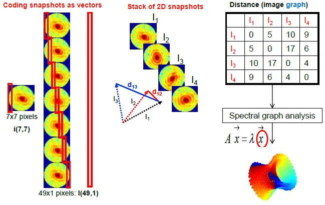

# Volumetric-3D-Stitching 

### Goal
Retrieving the 3D orientations of an object from its X-ray scattering patterns

### Approach
An analytical model (of the forward problem) suggests a numerical procedure (for the inverse problem) using Diffusion Map and the fisrt 9 non-trivial eigenvectors

### Open-Source Code
  1) Simulation of the forward problem and synthesis of 2D scattering patterns
  2) Forming the Distance Matrix of scattering patterns
  3) Retrieving the (relative)
   orientations using the Distance Matrix
  4) Plotting the results
  5) Implementations
     - Matlab ([arXiv:1411.7889](https://arxiv.org/abs/1411.7889))
     - [Octave](./src/octave/DiffusionMap3dOrientations.m)
     - [Python](./src/python/app.py)

