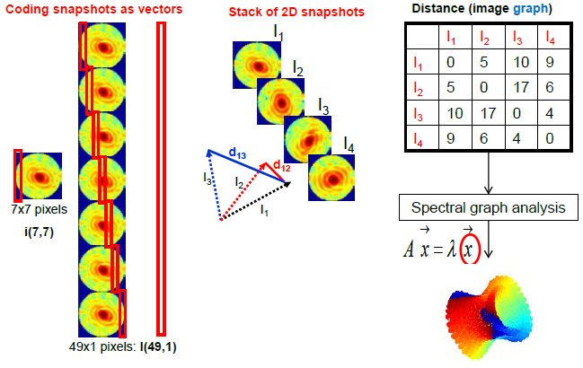

# Volumetric-3D-Stitching

Filling the 3D 'scattering volume' by appropriately-oriented 2D scattering patterns:
 
An analytical model (of the forward problem) suggests a numerical procedure (for the inverse problem) using Diffusion Map and the fisrt 9 non-trivial eigenvectors. The Matlab code here
 
  1) Simulates the forward problem and synthesizes 2D scattering patterns;
 
  2) Forms the Distance Matrix of scattering patterns; and
 
  3) Retrieves the (relative) orientations using the Distance Matrix.
 
More details: http://arxiv.org/abs/1411.7889

</img>

